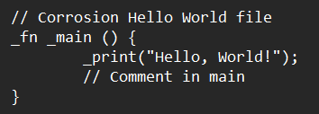
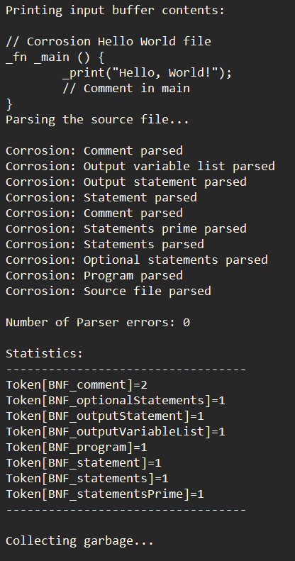
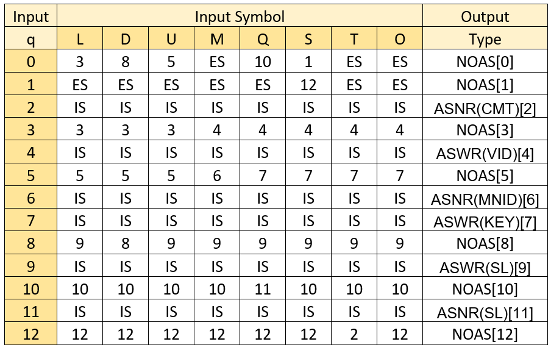
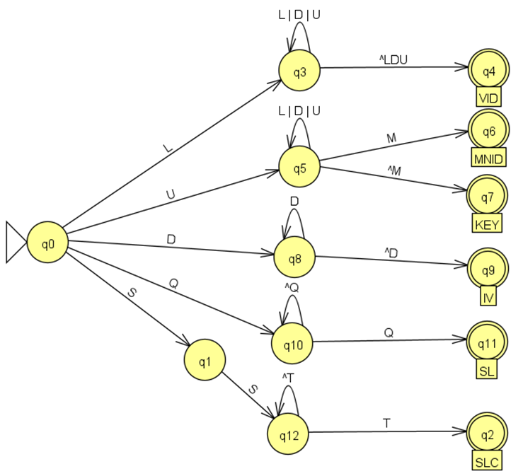
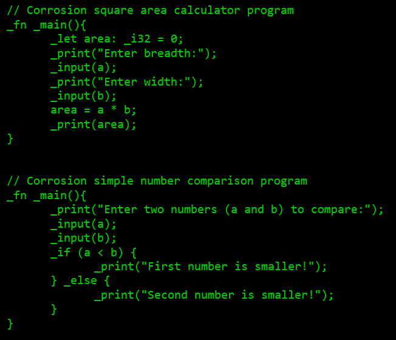

# Corrosion Compiler
A partial compiler (Reader, Scanner and Parser) for a custom language inspired by Rust called Corrosion.  
IMPORTANT NOTE: In-depth documentation can be found [here](Documentation.docx).
## Demo
Input file:  
Output:  
## Table of Contents
- [Features](#features)
- [Installation](#installation)  
- [Explanation](#explanation)
- [Further Examples](#examples)  </li>

### Features
- Reader.
- Scanner.
- Parser

### Installation
- Download and extract the [Demo.zip](Demo.zip)  file.
- Configure INPUT files with a text editor as desired (DO NOT RENAME). Further examples of code available [here](#examples).
- Run Parser.bat batch file.

### Explanation
Reader: The reader, often part of the lexer (lexical analyzer), is responsible for reading the source code as a sequence of characters. It groups these characters into meaningful units called tokens, such as keywords, identifiers, operators, and literals. The reader also handles removing white spaces and comments, which are not needed for further processing.
  
Scanner: The scanner, a component of the lexer, processes the input stream from the reader and converts it into a stream of tokens. It identifies the syntactic structure of the source code by recognizing keywords, symbols, and data structures, ensuring that each token is well-defined and valid according to the language's grammar.
  
Parser: The parser analyzes the sequence of tokens provided by the scanner. It checks the tokens against the syntax rules of the language to ensure they form a grammatically correct structure. The parser builds a parse tree or syntax tree, representing the hierarchical structure of the source code, which is then used for semantic analysis and code generation.
  
Transition Table and State Machine: The system uses a transition table and a state machine to manage state transitions based on the current state and input tokens. The transition table defines the set of rules for transitioning between states. 
  

  
The state machine operates on this table to maintain and update the state of the automaton. This mechanism ensures that the source code is processed according to the defined grammar, and helps in recognizing patterns, validating syntax, and identifying errors.
  

### Further Examples

